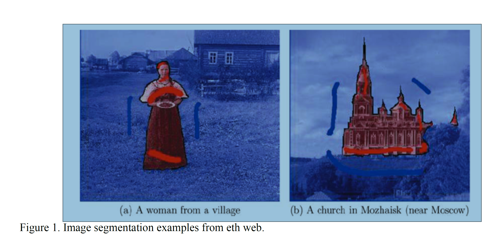

# Binary-Image-Segmentation

Binary Image segmentation is the process of classifying the pixels of an image into two categories: pixels
belonging to the foreground objects of an image and pixels belonging to the background objects of an image.

Figure 1 shows an example of image segmentation where the pixels belonging to the foreground objects are
highlighted in red and the pixels for the background are highlighted in blue. (Image I taken from the web). Image
segmentation is an important problem in image processing and computer vision with many application ranging
from background substraction and removal to object tracking, etc.
